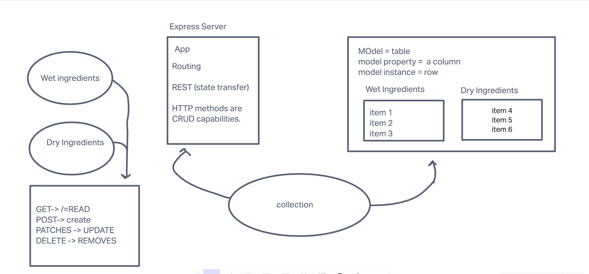

## Lab: 03  Express REST API

### Express-REST-API

### Author: Michael Campbell

#### Description: 
- Simple express server that uses a Get method from a Path/person.
-  Capable of  

#### Links:
[Heroku](link)

[repo](https://github.com/MichaelCampbell-on3001/basic-express-server)

#### Pull Request
[pull request description](link)

#### USED SQLite

### Setup
**Dependencies:**
- dotenv
- express
- jest
- nodemon
- supertest
- sequelize

#### Running the app
- npm start
- Endpoint/ error status
      - Return error message

#### Tests
- Server Test `npm run test`
- CRUD test
- DB Test

#### UML
(created with [diagrams](https://invisionapp.com/) )

